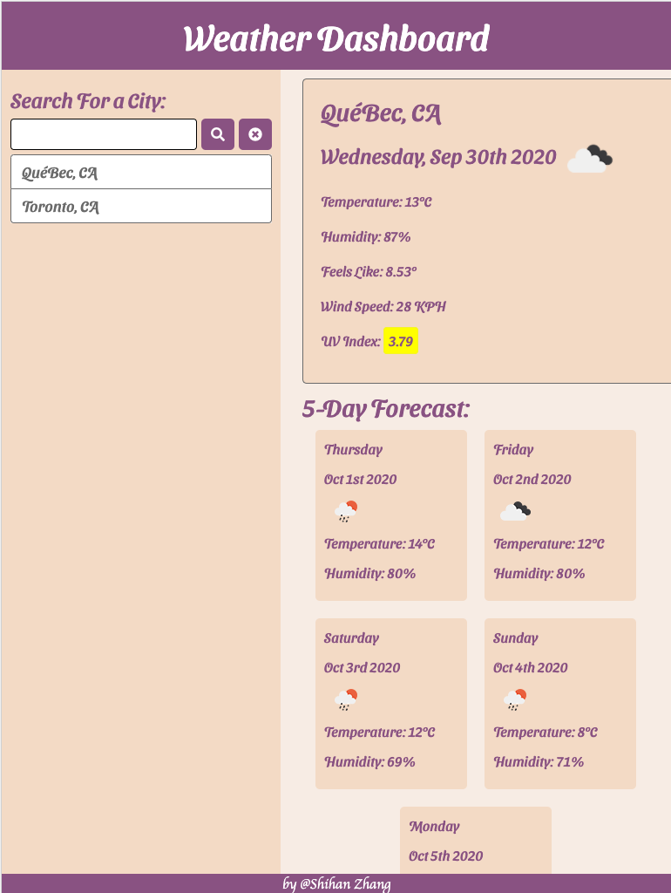

# Server-Side APIs: Weather App
Web Application:  https://corazhang.github.io/Weather-App/
* Developers are often tasked with retrieving data from another application's API and using it in the context of their own. Third-party APIs allow developers to access their data and functionality by making requests with specific parameters to a URL. Your challenge is to build a weather dashboard that will run in the browser and feature dynamically updated HTML and CSS.


Use the [OpenWeather API](https://openweathermap.org/api) to retrieve weather data for cities. The documentation includes a section called "How to start" that will provide basic setup and usage instructions. Use `localStorage` to store any persistent data.

## User Story

```
AS A traveler
I WANT to see the weather outlook for multiple cities
SO THAT I can plan a trip accordingly
```

## What is done
* If the city name is not found, there will be an alert box, the user then simply enter the city again
* Given a weather dashboard with form inputs
* Current and future conditions for searched cities are presented and added to search history
* City name, the date, an icon representation of weather conditions, the temperature, the humidity, the wind speed, and the UV index are presented when viewing current weather
* UV index are color-coded to show whether conditions are favorable, moderate, or severe
* Future 5-day forecast displays the date, an icon representation of weather conditions, the temperature, and the humidity
* When clicking the search history, current and future conditiona are showed again on dashboard
* When opening the dashboard again, it presents with last searched forecast


The following image demonstrates the application functionality:



